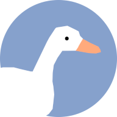

# Ducklake

Lake full of ducks you can feed, made with three.js

Implements self-made Component-Entity System primarily based on inheritence, and a very unrealistic though quite entertaining physics engine.

Can be installed as a PWA if you want to play with your ducks offline.
